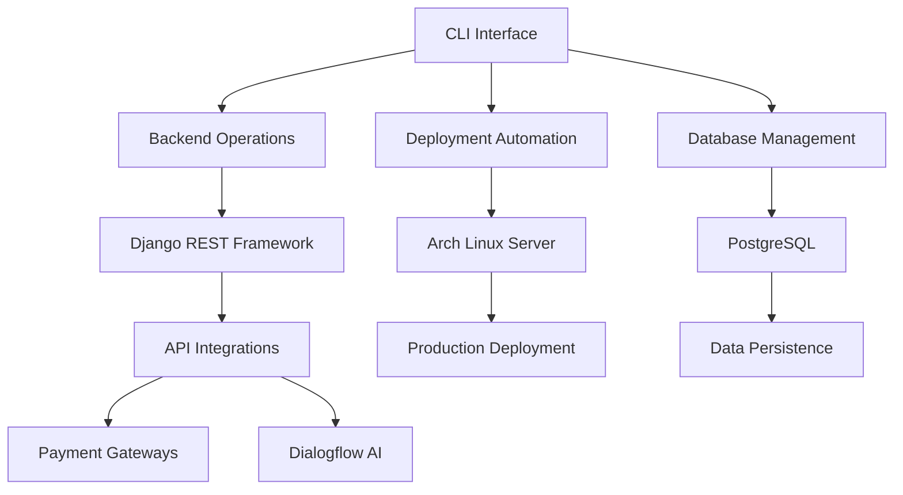
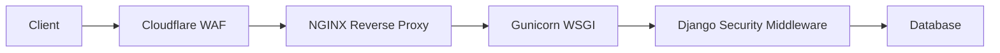

# 🛒 MJ Global Store - Enterprise-Grade E-Commerce Platform

 
 


**MJ Global Store** is a production-ready, full-stack eCommerce solution engineered with a CLI-first development philosophy. Built for performance at scale, it combines Django's robustness with modern DevOps practices and enterprise security standards.

> **🚧 Deployment Notice**  
> **MJ Global Store is currently under active development**  
> Core backend architecture is complete with frontend and API integrations in progress  
> Production deployment scheduled for Q3 2025

## 🌟 Why Choose MJ Global Store

| Feature | Benefit | Implementation Status |
|---------|---------|-----------------------|
| **CLI-First Architecture** | Full project lifecycle management through terminal | ✅ Complete |
| **Production-Ready Foundation** | Enterprise-grade security and scalability | 🚧 In Progress |
| **API-First Design** | Seamless third-party service integration | 🚧 In Progress |
| **Modular Codebase** | Independent component development/testing | ✅ Complete |
| **DevOps Automation** | CI/CD-ready infrastructure | ⏳ Phase 2 |



## 🧩 Technology Stack

### Backend Foundation


### Data Layer


### Frontend Ecosystem


### Infrastructure


## 🗂️ Project Architecture

```
mj-global-store/
├── 📁 backend/                 # Django core implementation
│   ├── core/                   # Project configuration
│   ├── users/                  # Auth system (JWT/OAuth2)
│   ├── products/               # Inventory management
│   ├── orders/                 # Transaction processing
│   ├── tests/                  # Pytest unit/integration tests
│   └── manage.py               # Django administration CLI
├── 📁 frontend/                # UI implementation
│   ├── public/                 # Static assets
│   ├── src/                    # Vanilla JS implementation
│   └── react-app/              # React integration (future)
├── 📁 infrastructure/          # Deployment configuration
│   ├── nginx/                  # Production server configs
│   ├── gunicorn/               # WSGI service configuration
│   └── arch_linux/             # Systemd service files
├── 📁 api_integration/         # Third-party services
│   ├── payment_gateways/       # Stripe/Razorpay modules
│   └── dialogflow/             # AI chatbot implementation
├── 📁 docs/                    # Technical documentation
│   ├── ARCHITECTURE.md         # System design decisions
│   ├── API_SPECS.md            # OpenAPI 3.0 specifications
│   ├── DEPLOYMENT_GUIDE.md     # Production setup
│   └── SECURITY.md             # Security protocols
├── ⚙️ .env.example             # Environment template
├── ⚙️ requirements.txt        # Python dependencies
├── ⚙️ docker-compose.yml       # Container orchestration
├── ⚙️ Makefile                 # Development automation
├── 📜 LICENSE                  # MIT License
├── 🚫 .gitignore               # Version control exclusions
└── 📖 README.md                # Project overview
```

## 📋 Core Features

### Implemented
- **Modular Django Architecture** - Apps for users, products, orders
- **RESTful API Endpoints** - JSON:API compliant interfaces
- **JWT Authentication** - Secure token-based user sessions
- **PostgreSQL Schema** - Optimized for eCommerce workloads
- **CLI Toolchain** - Project management via Makefile

### In Development
- **Stripe/Razorpay Integration** - PCI-compliant payments
- **Dialogflow Chatbot** - AI-powered customer support
- **React Admin Dashboard** - Real-time business analytics
- **Redis Caching** - Performance optimization layer
- **CI/CD Pipeline** - GitHub Actions automation

## 🚀 Getting Started

### Prerequisites
```bash
# Arch Linux
sudo pacman -S python postgresql redis nginx

# Ubuntu/Debian
sudo apt install python3 python3-venv postgresql redis-server nginx
```

### Installation
```bash
git clone https://github.com/JawadAbbasi14/mj-global-store.git
cd mj-global-store

# Create virtual environment
python -m venv .venv
source .venv/bin/activate

# Install dependencies
pip install -r requirements.txt

# Configure environment
cp .env.example .env
nano .env  # Set your credentials

# Database setup
sudo -u postgres psql -c "CREATE DATABASE mj_global_store;"
python manage.py migrate

# Create admin user
python manage.py createsuperuser
```

### Development Workflow
```bash
# Run backend server
make run-backend

# Execute tests
make test

# Generate documentation
make docs
```

## 🚀 Production Deployment

### NGINX Configuration (`infrastructure/nginx/mj-global-store.conf`)
```nginx
upstream django_app {
    server unix:/run/gunicorn.sock fail_timeout=0;
}

server {
    listen 80;
    server_name store.example.com;
    
    location / {
        proxy_set_header X-Forwarded-For $proxy_add_x_forwarded_for;
        proxy_set_header Host $http_host;
        proxy_redirect off;
        proxy_pass http://django_app;
    }
    
    location /static/ {
        alias /path/to/mj-global-store/static/;
        expires 30d;
    }
    
    location /media/ {
        alias /path/to/mj-global-store/media/;
        expires 30d;
    }
}
```

### Gunicorn Service (`infrastructure/gunicorn/gunicorn.service`)
```ini
[Unit]
Description=Gunicorn for MJ Global Store
After=network.target

[Service]
User=deploy
Group=www-data
WorkingDirectory=/path/to/mj-global-store/backend
ExecStart=/path/to/venv/bin/gunicorn core.wsgi:application \
    --workers 5 \
    --bind unix:/run/gunicorn.sock \
    --timeout 300 \
    --log-level=info

[Install]
WantedBy=multi-user.target
```

### Deployment Commands
```bash
# Collect static files
python manage.py collectstatic

# Start services
sudo systemctl start postgresql redis gunicorn nginx
```

## 🔒 Security Implementation

### Data Protection
- **AES-256 Encryption** for sensitive user data
- **Parameterized Queries** to prevent SQL injection
- **Payment Tokenization** (PCI-DSS Level 1 compliant)
- **Argon2 Password Hashing** with work factor 2

### Network Security


### Security Protocols
- **CSP Headers** for XSS mitigation
- **HSTS Enforcement** with 1-year duration
- **Rate Limiting** (10 req/sec per IP)
- **Automatic Security Updates** via pacman hook

## 🤝 Contribution Guidelines

### Workflow
1. Fork the repository
2. Create feature branch (`git checkout -b feature/your-feature`)
3. Commit changes (`git commit -am 'Add amazing feature'`)
4. Push to branch (`git push origin feature/your-feature`)
5. Open pull request

### Quality Standards
- Document new features in `docs/`
- Maintain 85%+ test coverage
- Follow PEP-8 style guidelines
- Validate changes with `make lint && make test`
- Update OpenAPI specs for API changes

## 📜 Licensing

This project is licensed under the **MIT License** - see [LICENSE](LICENSE) for details.

> **Commercial Use Notice**  
> For enterprise licensing or commercial support, contact [jawadabbasi@example.com](mailto:jawadabbasi@example.com)

## 🌐 Connect
<div align="center">
  <h3>📫 Let's Connect!</h3>
  
  <a href="https://github.com/JawadAbbasi14" target="_blank">
    
  </a>
  
  <a href="https://www.linkedin.com/in/mjabbasi-dev" target="_blank">
    
  </a>
  
  <a href="https://twitter.com/mjabbasi_dev" target="_blank">
    
  </a>
  
  <a href="mailto:jawadabbasi1107@gmail.com" target="_blank">
    
  </a>
</div>

---

> **🛠️ Development Status**  
> **MJ Global Store is in active development**  
> Backend core is production-ready - Frontend and API integrations are in progress  
> Target release: Q3 2025  
> Contribute on [GitHub](https://github.com/JawadAbbasi14/mj-global-store)
